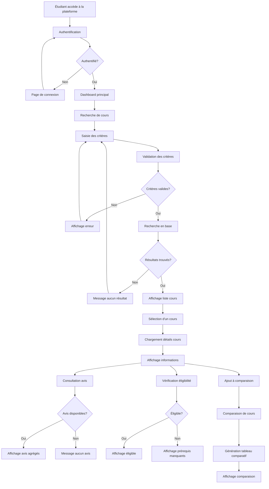
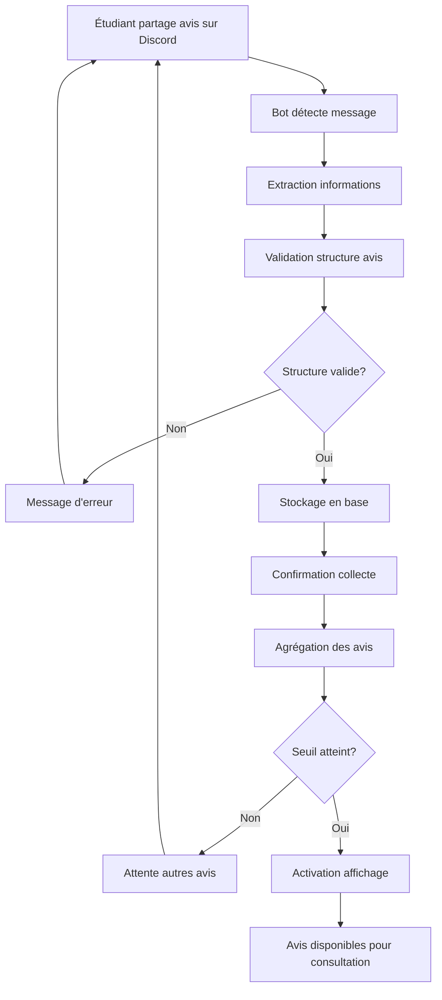
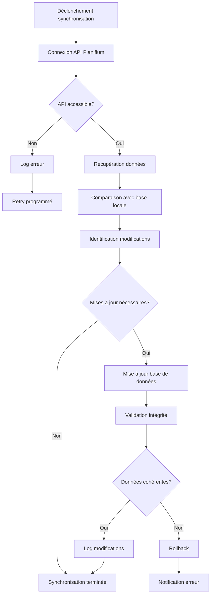
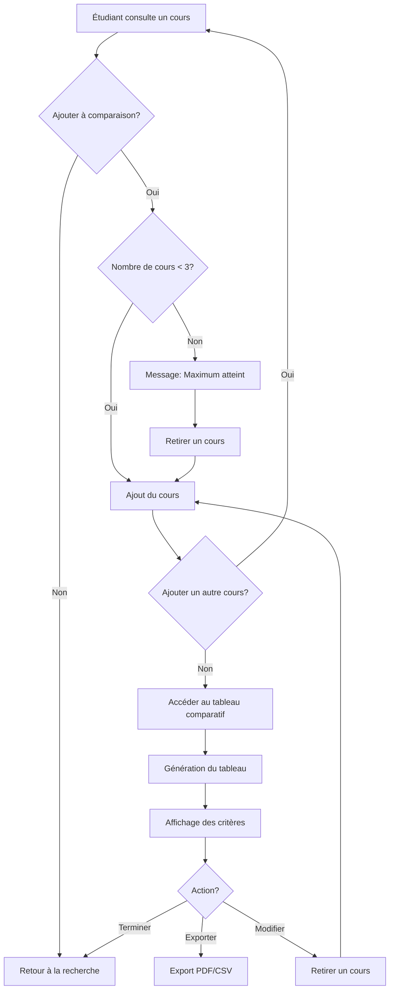

# Flux Principaux du Système

## Flux Principal - Recherche et Consultation de Cours

### Description du flux

1. **Authentification** : L'étudiant s'authentifie avec ses identifiants UdeM
2. **Recherche** : L'étudiant saisit ses critères de recherche (code, titre, programme)
3. **Validation** : Le système valide les critères et effectue la recherche
4. **Résultats** : Le système affiche les cours correspondants sous forme de cartes
5. **Consultation** : L'étudiant sélectionne un cours pour voir les détails
6. **Informations** : Le système affiche toutes les informations du cours
7. **Avis** : Si disponibles, les avis étudiants agrégés sont affichés
8. **Éligibilité** : Le système vérifie si l'étudiant peut s'inscrire
9. **Comparaison** : L'étudiant peut ajouter le cours à la comparaison

## Flux de Collecte d'Avis

### Description du flux

1. **Partage** : Un étudiant partage son avis sur un cours via Discord
2. **Détection** : Le bot Discord détecte le message contenant un avis
3. **Extraction** : Le bot extrait les informations structurées (code cours, note, commentaire)
4. **Validation** : Le système valide que l'avis respecte le format requis
5. **Stockage** : L'avis valide est stocké dans la base de données
6. **Agrégation** : Le système calcule les statistiques agrégées
7. **Seuil** : Si le seuil minimal (n≥5) est atteint, les avis deviennent visibles
8. **Affichage** : Les avis sont désormais consultables par les étudiants

## Flux de Synchronisation des Données

### Description du flux

1. **Déclenchement** : Synchronisation programmée ou manuelle
2. **Connexion** : Le système se connecte à l'API Planifium
3. **Récupération** : Téléchargement des données de cours mises à jour
4. **Comparaison** : Le système compare avec les données locales
5. **Identification** : Détection des cours modifiés, ajoutés ou supprimés
6. **Mise à jour** : Application des changements dans la base locale
7. **Validation** : Vérification de l'intégrité des données
8. **Log** : Enregistrement des modifications pour traçabilité

## Flux de Comparaison de Cours

### Description du flux

1. **Sélection** : L'étudiant ajoute un cours à la comparaison
2. **Vérification** : Le système vérifie la limite (max 3 cours)
3. **Ajout** : Le cours est ajouté à la liste de comparaison
4. **Tableau** : L'étudiant accède au tableau comparatif
5. **Génération** : Le système génère le tableau avec tous les critères
6. **Actions** : L'étudiant peut exporter, modifier ou terminer

