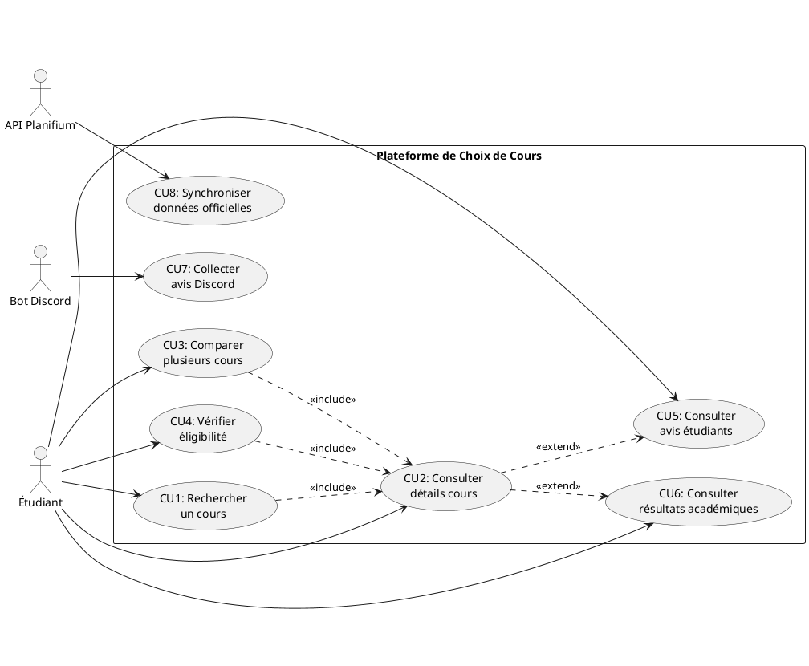
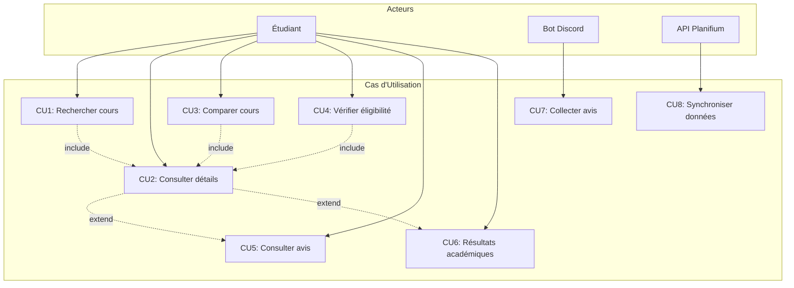
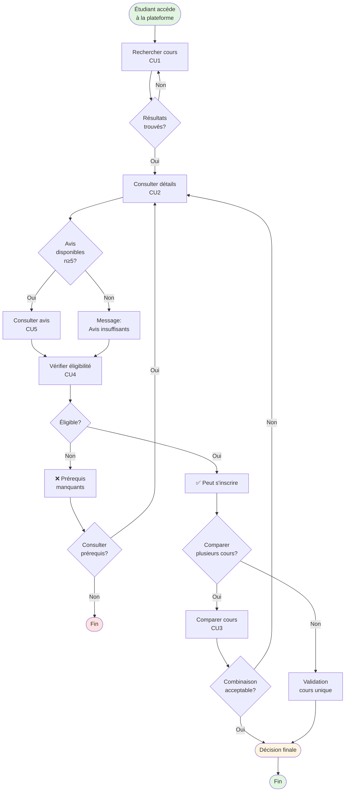

# Cas d'Utilisation

## Vue d'Ensemble

Le système de choix de cours propose plusieurs cas d'utilisation pour répondre aux besoins des étudiants dans leur processus de sélection de cours. Cette section présente les cas d'utilisation fonctionnels avec leurs scénarios détaillés.

## Acteurs du Système

### Acteurs Primaires

**Étudiant**
- **Description** : Utilisateur principal de la plateforme
- **Objectifs** : Rechercher, comparer, et sélectionner des cours de manière éclairée
- **Profils** : International, travailleur, débutant, finissant

### Acteurs Systèmes

**API Planifium**
- **Description** : Source officielle des données de cours
- **Rôle** : Fournit catalogue, prérequis, horaires

**Bot Discord**
- **Description** : Collecteur automatisé d'avis étudiants
- **Rôle** : Agrège les retours d'expérience

**Système de Résultats**
- **Description** : Base de données des résultats académiques
- **Rôle** : Fournit statistiques agrégées (moyennes, échecs)

## Diagramme de Cas d'Utilisation

### Version UML (PlantUML)



### Version Simplifiée (Mermaid)



## Liste des Cas d'Utilisation

| ID | Nom | Acteur | Priorité | Complexité |
|----|-----|--------|----------|------------|
| CU1 | Rechercher un cours | Étudiant | 🔴 Critique | Moyenne |
| CU2 | Consulter détails d'un cours | Étudiant | 🔴 Critique | Faible |
| CU3 | Comparer plusieurs cours | Étudiant | 🟡 Haute | Élevée |
| CU4 | Vérifier éligibilité | Étudiant | 🟡 Haute | Élevée |
| CU5 | Consulter avis étudiants | Étudiant | 🟡 Haute | Moyenne |
| CU6 | Consulter résultats académiques | Étudiant | 🟢 Moyenne | Faible |
| CU7 | Collecter avis Discord | Bot Discord | 🟡 Haute | Moyenne |
| CU8 | Synchroniser données officielles | API Planifium | 🔴 Critique | Élevée |

---

## Cas d'Utilisation Détaillés

### CU1 - Rechercher un Cours

#### Informations Générales

| Attribut | Valeur |
|----------|--------|
| **ID** | CU1 |
| **Nom** | Rechercher un cours |
| **Acteurs** | Étudiant (primaire) |
| **Préconditions** | - Accès à la plateforme<br>- Base de données de cours disponible |
| **Postconditions** | - Liste de cours affichée<br>- Résultats triés par pertinence |
| **Déclencheur** | Étudiant saisit critères de recherche |
| **Dépendances** | Aucune |
| **Priorité** | 🔴 Critique |

#### But
Permettre à l'étudiant de trouver rapidement des cours correspondant à ses critères (code, titre, mots-clés) avec une recherche intuitive et performante.

#### Scénario Principal (Nominal)

1. **L'étudiant accède à la page de recherche**
   - 1.1 Le système affiche le champ de recherche et filtres optionnels
   - 1.2 Le système affiche des suggestions populaires (optionnel)

2. **L'étudiant saisit des critères de recherche**
   - 2.1 Critère possible : Code de cours (ex: "IFT2255")
   - 2.2 Critère possible : Titre complet ou partiel (ex: "génie logiciel")
   - 2.3 Critère possible : Mots-clés (ex: "programmation", "base de données")
   - 2.4 Le système affiche suggestions en temps réel (auto-complétion)

3. **Le système valide les critères**
   - 3.1 Vérification format (longueur, caractères autorisés)
   - 3.2 Sanitisation des entrées (sécurité XSS)

4. **Le système interroge la base de données**
   - 4.1 Construction de la requête SQL avec filtres
   - 4.2 Exécution de la recherche (< 2 secondes)
   - 4.3 Application des filtres optionnels (session, crédits, niveau)

5. **Le système affiche les résultats**
   - 5.1 Liste paginée (10 cours par page)
   - 5.2 Affichage : code, titre, crédits, session disponible
   - 5.3 Indicateurs visuels (difficulté, charge) si disponibles
   - 5.4 Nombre total de résultats affiché

6. **L'étudiant interagit avec les résultats**
   - 6.1 Possibilité de trier (alphabétique, crédits, difficulté)
   - 6.2 Possibilité de filtrer davantage
   - 6.3 Sélection d'un cours → Redirection vers CU2

#### Scénarios Alternatifs

**3a. Critères invalides**
- 3a.1 Le système détecte des caractères interdits ou format incorrect
- 3a.2 Message d'erreur : "Veuillez saisir un code ou titre valide"
- 3a.3 Retour à l'étape 2

**4a. Aucun résultat trouvé**
- 4a.1 La recherche ne retourne aucun cours
- 4a.2 Message : "Aucun cours trouvé pour '{critères}'"
- 4a.3 Suggestions : "Vérifiez l'orthographe" ou "Essayez des mots-clés plus généraux"
- 4a.4 Affichage de cours populaires comme alternatives

**4b. Trop de résultats (>100)**
- 4b.1 Le système limite à 100 premiers résultats
- 4b.2 Message : "100+ résultats trouvés. Affinez votre recherche."
- 4b.3 Proposition de filtres supplémentaires (session, niveau, département)

**5a. Erreur serveur**
- 5a.1 La base de données est inaccessible
- 5a.2 Message : "Service temporairement indisponible"
- 5a.3 Retry automatique après 3 secondes
- 5a.4 Si échec persistant : suggestion de contacter support

#### Scénarios d'Exception

**Ex1. Recherche vide**
- L'étudiant soumet sans saisir de critères
- Message : "Veuillez saisir au moins un critère de recherche"

**Ex2. Timeout de recherche (>5s)**
- Annulation de la requête
- Message : "La recherche prend trop de temps. Essayez des critères plus spécifiques."

#### Critères d'Acceptation

- ✅ Recherche retourne résultats en < 2 secondes (95% des cas)
- ✅ Auto-complétion fonctionne dès 3 caractères
- ✅ Supporte codes (IFT2255), titres partiels, mots-clés
- ✅ Aucune faille XSS/injection SQL
- ✅ Résultats pertinents (tri par pertinence)

---

### CU2 - Consulter les Détails d'un Cours

#### Informations Générales

| Attribut | Valeur |
|----------|--------|
| **ID** | CU2 |
| **Nom** | Consulter les détails d'un cours |
| **Acteurs** | Étudiant (primaire) |
| **Préconditions** | - Cours existe dans la base<br>- Données du cours disponibles |
| **Postconditions** | - Détails complets affichés<br>- Accès aux fonctionnalités liées (avis, résultats) |
| **Déclencheur** | Étudiant sélectionne un cours depuis recherche ou lien direct |
| **Dépendances** | CU1 (Rechercher un cours) - optionnel |
| **Priorité** | 🔴 Critique |

#### But
Fournir une vue complète et structurée de toutes les informations pertinentes d'un cours pour permettre une évaluation approfondie.

#### Scénario Principal (Nominal)

1. **L'étudiant sélectionne un cours**
   - 1.1 Clic sur un résultat de recherche
   - 1.2 OU accès direct via URL (ex: `/cours/IFT2255`)

2. **Le système charge les données du cours**
   - 2.1 Requête à la base de données principale
   - 2.2 Vérification de l'existence du cours
   - 2.3 Chargement des données liées (prérequis, horaires, avis)

3. **Le système affiche les informations de base**
   - 3.1 **En-tête** : Code, Titre complet, Nombre de crédits
   - 3.2 **Description officielle** : Texte du plan de cours
   - 3.3 **Session(s) offerte(s)** : Automne, Hiver, Été
   - 3.4 **Département** : DIRO, Mathématiques, etc.
   - 3.5 **Cycle** : 1er cycle, 2e cycle, 3e cycle

4. **Le système affiche les prérequis et co-requis**
   - 4.1 Liste des prérequis avec codes cliquables
   - 4.2 Co-requis si applicables
   - 4.3 Indication visuelle : ✅ Complété / ❌ Non complété (si profil activé)
   - 4.4 Lien vers vérification d'éligibilité (CU4)

5. **Le système affiche les horaires disponibles**
   - 5.1 Session actuelle ou prochaine
   - 5.2 Groupes disponibles (cours magistral, laboratoires)
   - 5.3 Professeur(s) si connu
   - 5.4 Places disponibles si accessible

6. **Le système affiche les résultats académiques agrégés**
   - 6.1 Moyenne générale (ex: 3.2/4.3)
   - 6.2 Nombre d'étudiants inscrits (session précédente)
   - 6.3 Taux d'échec (ex: 12%)
   - 6.4 Graphique de distribution des notes (optionnel)
   - 6.5 Évolution sur 3 dernières sessions (tendances)

7. **Le système affiche les avis étudiants**
   - 7.1 Vérification du seuil minimal (n≥5)
   - 7.2 Statistiques agrégées : Difficulté moyenne (1-5), Charge de travail (h/semaine)
   - 7.3 Aperçu des 3 avis les plus récents
   - 7.4 Lien vers page complète des avis (CU5)

8. **L'étudiant accède aux actions disponibles**
   - 8.1 Bouton "Ajouter à la comparaison" → CU3
   - 8.2 Bouton "Vérifier mon éligibilité" → CU4
   - 8.3 Bouton "Voir tous les avis" → CU5
   - 8.4 Bouton "Partager" (optionnel)

#### Scénarios Alternatifs

**2a. Cours non trouvé (404)**
- 2a.1 Le code de cours n'existe pas dans la base
- 2a.2 Page d'erreur : "Le cours {code} n'a pas été trouvé"
- 2a.3 Suggestions : Cours similaires ou recherche

**7a. Avis insuffisants (n<5)**
- 7a.1 Moins de 5 avis disponibles
- 7a.2 Message : "Pas assez d'avis pour afficher des statistiques fiables"
- 7a.3 Invitation : "Soyez le premier à partager votre expérience"

**7b. Aucun avis disponible**
- 7b.1 Aucun avis collecté pour ce cours
- 7b.2 Section avis masquée ou message explicatif
- 7b.3 Suggestion de consulter forums externes (avec disclaimer)

**5a. Horaires non disponibles**
- 5a.1 Session pas encore planifiée
- 5a.2 Message : "Horaires non disponibles pour la session sélectionnée"
- 5a.3 Affichage des horaires de session précédente (avec avertissement)

#### Scénarios d'Exception

**Ex1. Erreur de chargement données**
- Timeout ou erreur API Planifium
- Affichage partiel avec avertissement : "Certaines informations ne sont pas à jour"
- Utilisation du cache si disponible

**Ex2. Données incohérentes**
- Divergence majeure entre sources (API vs avis)
- Affichage des deux avec disclaimer
- Indicateur de fiabilité réduit

#### Critères d'Acceptation

- ✅ Page se charge en < 2 secondes
- ✅ Toutes les sections sont présentes et structurées
- ✅ Prérequis sont cliquables (navigation vers autres cours)
- ✅ Avis affichés uniquement si n≥5
- ✅ Données à jour (< 24h depuis dernière synchro)
- ✅ Responsive (mobile, tablette, desktop)

---

### CU3 - Comparer Plusieurs Cours

#### Informations Générales

| Attribut | Valeur |
|----------|--------|
| **ID** | CU3 |
| **Nom** | Comparer plusieurs cours |
| **Acteurs** | Étudiant (primaire) |
| **Préconditions** | - Au moins 2 cours sélectionnés<br>- Données des cours disponibles |
| **Postconditions** | - Tableau comparatif affiché<br>- Décision facilitée |
| **Déclencheur** | Étudiant sélectionne 2+ cours pour comparaison |
| **Dépendances** | CU2 (Consulter détails) |
| **Priorité** | 🟡 Haute |

#### But
Faciliter la prise de décision en affichant côte à côte les caractéristiques clés de plusieurs cours pour évaluer leur compatibilité et charge totale.

#### Scénario Principal (Nominal)

1. **L'étudiant sélectionne des cours à comparer**
   - 1.1 Depuis la page de détails (CU2) : Clic "Ajouter à la comparaison"
   - 1.2 OU depuis la recherche : Checkbox sur plusieurs cours
   - 1.3 Indicateur visuel : Nombre de cours dans la comparaison (badge)

2. **Le système valide la sélection**
   - 2.1 Vérification : Minimum 2 cours, maximum 5 cours
   - 2.2 Stockage temporaire (session browser, pas localStorage)

3. **L'étudiant accède à la page de comparaison**
   - 3.1 Clic sur "Comparer (X cours)"
   - 3.2 Redirection vers `/comparaison`

4. **Le système charge les données des cours sélectionnés**
   - 4.1 Requête parallèle pour tous les cours
   - 4.2 Agrégation des informations
   - 4.3 Calcul des totaux (crédits, charge estimée)

5. **Le système génère le tableau comparatif**
   - 5.1 **Colonnes** : Un cours par colonne
   - 5.2 **Lignes de comparaison** :
     - Code et titre
     - Crédits
     - Difficulté moyenne (1-5) avec icônes ⭐
     - Charge de travail (h/semaine)
     - Prérequis satisfaits (✅ / ❌)
     - Taux d'échec (%)
     - Moyenne de classe
     - Horaires (conflits détectés 🔴)
   - 5.3 **Ligne de totaux** :
     - Total crédits
     - Charge totale estimée
     - Alertes si charge > 40h/semaine

6. **Le système affiche des indicateurs visuels**
   - 6.1 Code couleur : Vert (facile), Jaune (moyen), Rouge (difficile)
   - 6.2 Alerte si conflit d'horaire détecté
   - 6.3 Alerte si prérequis non satisfait
   - 6.4 Recommandation : "Combinaison équilibrée" ou "Charge élevée"

7. **L'étudiant interagit avec la comparaison**
   - 7.1 Ajout/Retrait de cours dynamique
   - 7.2 Réorganisation des colonnes (drag & drop)
   - 7.3 Export en PDF ou image (optionnel)
   - 7.4 Partage du lien de comparaison (optionnel)

#### Scénarios Alternatifs

**1a. Moins de 2 cours sélectionnés**
- 1a.1 L'étudiant essaie d'accéder à la comparaison
- 1a.2 Message : "Veuillez sélectionner au moins 2 cours"
- 1a.3 Redirection vers recherche

**2a. Plus de 5 cours sélectionnés**
- 2a.1 L'étudiant tente d'ajouter un 6e cours
- 2a.2 Message : "Maximum 5 cours pour une comparaison lisible"
- 2a.3 Proposition de retirer un cours existant

**4a. Données manquantes pour certains cours**
- 4a.1 Avis ou résultats indisponibles
- 4a.2 Affichage "N/A" avec tooltip explicatif
- 4a.3 Comparaison possible avec données partielles

**6a. Conflit d'horaire détecté**
- 6a.1 Deux cours ou plus ont des horaires qui se chevauchent
- 6a.2 Alerte visuelle 🔴 : "Conflit d'horaire détecté"
- 6a.3 Détail des conflits au survol
- 6a.4 Suggestion : "Ces cours ne peuvent être suivis simultanément"

**6b. Prérequis non satisfait**
- 6b.1 L'étudiant n'a pas complété un prérequis (si profil actif)
- 6b.2 Icône ⚠️ avec message : "Prérequis non satisfait"
- 6b.3 Lien vers le cours prérequis

#### Scénarios d'Exception

**Ex1. Charge totale critique (>50h/semaine)**
- Alerte rouge : "⚠️ Charge de travail excessive détectée"
- Recommandation : "Nous déconseillons cette combinaison"

**Ex2. Tous les cours sont très difficiles**
- Alerte : "Combinaison très exigeante. Considérez équilibrer avec un cours plus léger."

#### Critères d'Acceptation

- ✅ Comparaison de 2-5 cours simultanés
- ✅ Tableau responsive (scroll horizontal si nécessaire)
- ✅ Détection automatique des conflits d'horaire
- ✅ Calcul précis de la charge totale
- ✅ Indicateurs visuels clairs (couleurs, icônes)
- ✅ Temps de génération < 3 secondes

---

### CU4 - Vérifier l'Éligibilité à un Cours

#### Informations Générales

| Attribut | Valeur |
|----------|--------|
| **ID** | CU4 |
| **Nom** | Vérifier l'éligibilité à un cours |
| **Acteurs** | Étudiant (primaire) |
| **Préconditions** | - Cours sélectionné<br>- Prérequis définis pour le cours |
| **Postconditions** | - Éligibilité déterminée (✅ / ❌)<br>- Raisons explicites fournies |
| **Déclencheur** | Étudiant clique "Vérifier mon éligibilité" |
| **Dépendances** | CU2 (Consulter détails) |
| **Priorité** | 🟡 Haute |

#### But
Permettre à l'étudiant de vérifier s'il satisfait tous les prérequis et contraintes pour s'inscrire à un cours donné, et identifier les cours manquants si nécessaire.

#### Scénario Principal (Nominal)

1. **L'étudiant accède à la vérification d'éligibilité**
   - 1.1 Depuis la page de détails d'un cours (CU2)
   - 1.2 Clic sur "Vérifier mon éligibilité"

2. **Le système affiche le formulaire de vérification**
   - 2.1 Liste des prérequis du cours
   - 2.2 Liste des co-requis si applicables
   - 2.3 Contraintes additionnelles (cycle, programme, statut)

3. **L'étudiant indique les cours complétés**
   - 3.1 Deux options :
     - **Option A** : Saisie manuelle (checkboxes des prérequis)
     - **Option B** : Import liste de cours (CSV, copier-coller)
   - 3.2 Pour chaque prérequis : Cocher si complété avec succès

4. **Le système valide les informations**
   - 4.1 Vérification de la cohérence des données saisies
   - 4.2 Validation du format (codes de cours valides)

5. **Le système analyse l'éligibilité**
   - 5.1 Vérification des prérequis obligatoires
   - 5.2 Vérification des prérequis conditionnels (OU logique)
   - 5.3 Vérification des co-requis
   - 5.4 Vérification des contraintes de cycle/programme

6. **Le système affiche le résultat**
   - 6.1 **Si éligible** :
     - ✅ "Vous êtes éligible pour ce cours !"
     - Résumé : Tous les prérequis satisfaits
   - 6.2 **Si non éligible** :
     - ❌ "Vous n'êtes pas encore éligible pour ce cours"
     - Liste des prérequis manquants avec codes cliquables
     - Suggestion : Ordre recommandé pour compléter les prérequis

7. **L'étudiant accède aux recommandations**
   - 7.1 Si non éligible : Affichage du chemin suggéré
   - 7.2 Exemple : "Complétez IFT1015, puis IFT1025, puis IFT2255"
   - 7.3 Liens cliquables vers les cours prérequis

#### Scénarios Alternatifs

**3a. Aucun prérequis**
- 3a.1 Le cours n'a aucun prérequis
- 3a.2 Message : "✅ Ce cours n'a aucun prérequis. Vous êtes éligible !"
- 3a.3 Vérification cycle/programme uniquement

**5a. Prérequis alternatifs (OU logique)**
- 5a.1 Le cours accepte plusieurs prérequis alternatifs (ex: IFT1015 OU MAT1978)
- 5a.2 Vérification : Au moins un des prérequis satisfait
- 5a.3 Affichage : "Prérequis satisfait (IFT1015 ou MAT1978) ✅"

**5b. Co-requis non satisfait**
- 5b.1 Le co-requis n'est pas encore complété
- 5b.2 Message : "⚠️ Co-requis requis : Vous devez suivre {cours} en même temps"
- 5b.3 Option : Planifier les deux cours ensemble

**6a. Éligibilité partielle (prérequis en cours)**
- 6a.1 L'étudiant suit actuellement un prérequis
- 6a.2 Message : "⏳ Vous serez éligible après avoir complété {cours}"
- 6a.3 Suggestion : "Planifiez ce cours pour la session suivante"

#### Scénarios d'Exception

**Ex1. Données de prérequis incohérentes**
- Logique circulaire ou contradictoire dans la base de données
- Message : "Erreur dans les prérequis. Veuillez contacter le département."

**Ex2. Trop de prérequis manquants (>5)**
- Message : "Vous avez plusieurs prérequis à compléter. Consultez le cheminement de votre programme."
- Affichage d'un chemin type sur plusieurs sessions

#### Critères d'Acceptation

- ✅ Validation des prérequis simple ET complexe (OU logique)
- ✅ Gestion des co-requis
- ✅ Interface claire avec codes couleur (vert/rouge)
- ✅ Suggestions de chemin si non éligible
- ✅ Liens cliquables vers cours prérequis
- ✅ Temps de vérification < 1 seconde

---

### CU5 - Consulter les Avis Étudiants

#### Informations Générales

| Attribut | Valeur |
|----------|--------|
| **ID** | CU5 |
| **Nom** | Consulter les avis étudiants |
| **Acteurs** | Étudiant (primaire) |
| **Préconditions** | - Cours sélectionné<br>- Avis disponibles (n≥5) |
| **Postconditions** | - Avis agrégés et individuels consultés<br>- Perception du cours enrichie |
| **Déclencheur** | Étudiant accède à la section avis d'un cours |
| **Dépendances** | CU2 (Consulter détails) |
| **Priorité** | 🟡 Haute |

#### But
Fournir un accès structuré aux retours d'expérience des étudiants ayant suivi le cours, avec agrégation statistique et possibilité de filtrer par critères.

#### Scénario Principal (Nominal)

1. **L'étudiant accède à la section avis**
   - 1.1 Depuis la page de détails (CU2) : Clic "Voir tous les avis"
   - 1.2 OU accès direct : `/cours/{code}/avis`

2. **Le système vérifie le nombre d'avis disponibles**
   - 2.1 Comptage des avis validés pour ce cours
   - 2.2 Vérification du seuil minimal (n≥5)
   - 2.3 Si n<5 : Affichage message "Avis insuffisants" et arrêt

3. **Le système affiche les statistiques agrégées**
   - 3.1 **Vue d'ensemble** :
     - Nombre total d'avis (ex: 23 avis)
     - Période couverte (ex: "Basé sur avis de 2022 à 2025")
   - 3.2 **Difficulté perçue** :
     - Moyenne : 3.8/5 ⭐⭐⭐⭐
     - Distribution : Graphique en barres (combien de 1/5, 2/5, etc.)
   - 3.3 **Charge de travail** :
     - Moyenne : 12h/semaine
     - Plage : 8-18h/semaine (min-max)
     - Distribution : Histogramme
   - 3.4 **Satisfaction globale** (si collectée) :
     - Recommanderiez-vous ce cours ? 78% Oui

4. **Le système affiche les avis individuels**
   - 4.1 Tri par défaut : Plus récents en premier
   - 4.2 Pour chaque avis :
     - Session suivie (ex: A2024)
     - Difficulté : 4/5 ⭐⭐⭐⭐
     - Charge : 15h/semaine
     - Commentaire (texte libre, max 500 caractères)
     - Date de publication (ex: "il y a 2 mois")
   - 4.3 Pagination : 10 avis par page

5. **L'étudiant applique des filtres**
   - 5.1 **Filtres disponibles** :
     - Par session (A2024, H2024, A2023, etc.)
     - Par difficulté (1-2: Facile, 3: Moyen, 4-5: Difficile)
     - Par charge (<10h, 10-15h, >15h)
   - 5.2 Application dynamique des filtres (sans rechargement)
   - 5.3 Mise à jour des statistiques agrégées selon filtres

6. **L'étudiant trie les avis**
   - 6.1 Options de tri :
     - Plus récents
     - Plus anciens
     - Difficulté croissante/décroissante
     - Charge croissante/décroissante
   - 6.2 Tri appliqué instantanément

7. **L'étudiant consulte les détails d'un avis**
   - 7.1 Expansion d'un avis (si commentaire tronqué)
   - 7.2 Affichage du commentaire complet
   - 7.3 Possibilité de signaler un avis problématique (optionnel)

#### Scénarios Alternatifs

**2a. Avis insuffisants (n<5)**
- 2a.1 Moins de 5 avis disponibles
- 2a.2 Page affichée avec message :
   - "⚠️ Pas assez d'avis pour garantir des statistiques fiables"
   - "Actuellement : X avis (minimum requis : 5)"
- 2a.3 Invitation : "Partagez votre expérience sur Discord"
- 2a.4 Lien vers le serveur Discord DIRO

**4a. Avis très récents uniquement**
- 4a.1 Tous les avis datent de moins de 3 mois
- 4a.2 Avertissement : "Avis récents uniquement. Les tendances peuvent ne pas être représentatives."

**4b. Avis très anciens uniquement**
- 4b.1 Tous les avis datent de plus de 2 ans
- 4b.2 Avertissement : "⚠️ Avis anciens. Le cours peut avoir évolué (nouveau professeur, contenu mis à jour)."

**5a. Filtres trop restrictifs (0 résultat)**
- 5a.1 Aucun avis ne correspond aux filtres appliqués
- 5a.2 Message : "Aucun avis ne correspond à vos critères"
- 5a.3 Suggestion : "Élargissez vos filtres"
- 5a.4 Bouton "Réinitialiser les filtres"

**7a. Avis signalé comme problématique**
- 7a.1 Un avis a été signalé par plusieurs utilisateurs
- 7a.2 Badge : "En cours de vérification"
- 7a.3 Avis maintenu visible mais avec avertissement

#### Scénarios d'Exception

**Ex1. Divergence majeure avis vs résultats officiels**
- Les avis indiquent "très difficile" mais taux d'échec est bas
- Disclaimer : "Les perceptions peuvent varier. Consultez aussi les résultats académiques."

**Ex2. Commentaires inappropriés détectés**
- Système de modération automatique détecte contenu offensant
- Avis masqué en attente de validation manuelle

#### Critères d'Acceptation

- ✅ Affichage uniquement si n≥5 avis
- ✅ Statistiques agrégées claires (moyennes, distributions)
- ✅ Filtres fonctionnels et rapides (< 0.5s)
- ✅ Tri instantané sans rechargement de page
- ✅ Pagination fluide (10 avis/page)
- ✅ Avertissement si avis anciens (>2 ans)
- ✅ Anonymisation complète (pas de noms)

---

## Cas d'Utilisation Système

### CU7 - Collecter les Avis Étudiants (Bot Discord)

#### Informations Générales

| Attribut | Valeur |
|----------|--------|
| **ID** | CU7 |
| **Nom** | Collecter les avis étudiants via Discord |
| **Acteurs** | Bot Discord (primaire), Étudiant (secondaire) |
| **Préconditions** | - Bot Discord actif<br>- Serveur Discord DIRO accessible<br>- Canal dédié configuré |
| **Postconditions** | - Avis stocké dans la base<br>- Confirmation envoyée à l'étudiant |
| **Déclencheur** | Étudiant utilise commande Discord |
| **Dépendances** | Aucune |
| **Priorité** | 🟡 Haute |

#### But
Automatiser la collecte structurée des retours d'expérience étudiants via une interface Discord familière, avec validation et stockage sécurisé.

#### Scénario Principal (Nominal)

1. **L'étudiant soumet un avis via Discord**
   - 1.1 Dans le canal #avis-cours du serveur DIRO
   - 1.2 Commande : `!avis IFT2255 difficulte:4 charge:15 "Cours excellent mais charge importante"`
   - 1.3 Format : `!avis {code} difficulte:{1-5} charge:{heures} "{commentaire optionnel}"`

2. **Le bot détecte et parse la commande**
   - 2.1 Reconnaissance du préfixe `!avis`
   - 2.2 Extraction des paramètres :
     - Code cours : IFT2255
     - Difficulté : 4 (sur échelle 1-5)
     - Charge : 15 (heures/semaine)
     - Commentaire : Texte entre guillemets

3. **Le bot valide les données**
   - 3.1 **Code cours** : Existe dans la base Planifium
   - 3.2 **Difficulté** : Entre 1 et 5
   - 3.3 **Charge** : Entre 0 et 40 heures/semaine
   - 3.4 **Commentaire** : Max 500 caractères, pas de contenu offensant

4. **Le bot anonymise l'utilisateur**
   - 4.1 Récupération du Discord User ID
   - 4.2 Hachage (SHA-256) pour anonymisation
   - 4.3 Aucune donnée identifiante stockée

5. **Le bot stocke l'avis**
   - 5.1 Requête POST vers l'API de la plateforme
   - 5.2 Endpoint : `/api/v1/avis`
   - 5.3 Payload JSON :
   ```json
   {
     "code_cours": "IFT2255",
     "session": "A2025",
     "difficulte": 4,
     "charge_travail": 15,
     "commentaire": "Cours excellent mais charge importante",
     "hash_utilisateur": "a3f5e8d9...",
     "timestamp": "2025-10-10T14:30:00Z"
   }
   ```

6. **Le bot confirme la soumission**
   - 6.1 Message de confirmation :
     - ✅ "Merci pour votre avis sur IFT2255 !"
     - "Votre retour aidera d'autres étudiants à faire leur choix."
   - 6.2 Réaction emoji sur le message original (✅)

#### Scénarios Alternatifs

**3a. Code cours invalide**
- 3a.1 Le code n'existe pas (ex: IFT9999)
- 3a.2 Message d'erreur : "❌ Le cours 'IFT9999' n'existe pas. Vérifiez le code."
- 3a.3 Suggestion : Affichage de cours similaires si typo détectée

**3b. Difficulté hors limites**
- 3b.1 Valeur < 1 ou > 5
- 3b.2 Message : "❌ La difficulté doit être entre 1 (facile) et 5 (très difficile)"

**3c. Charge irréaliste**
- 3c.1 Charge > 40h/semaine ou < 0
- 3c.2 Message : "❌ Charge de travail doit être entre 0 et 40 heures/semaine"

**3d. Commentaire trop long**
- 3d.1 Plus de 500 caractères
- 3d.2 Message : "❌ Commentaire trop long (max 500 caractères). Actuellement : {n}"

**3e. Contenu inapproprié détecté**
- 3e.1 Détection de mots-clés offensants
- 3e.2 Message : "❌ Votre avis contient du contenu inapproprié. Veuillez reformuler."
- 3e.3 Log pour modération manuelle

**5a. Erreur de stockage (API down)**
- 5a.1 L'API de la plateforme est inaccessible
- 5a.2 Message : "⚠️ Service temporairement indisponible. Réessayez dans quelques minutes."
- 5a.3 Stockage temporaire local (retry automatique après 5min)

**6a. Avis en double (même utilisateur, même cours)**
- 6a.1 L'utilisateur a déjà soumis un avis pour ce cours cette session
- 6a.2 Message : "⚠️ Vous avez déjà soumis un avis pour IFT2255. Modification non autorisée."
- 6a.3 Alternative : Permettre mise à jour avec confirmation

#### Scénarios d'Exception

**Ex1. Spam / Rate limiting**
- Détection de multiples avis en peu de temps (>5 en 1h)
- Blocage temporaire (cooldown 1h)
- Message : "⏳ Trop d'avis soumis. Réessayez dans 1 heure."

**Ex2. Format de commande invalide**
- Commande mal formée
- Message d'aide automatique :
```
ℹ️ Format correct : !avis {CODE} difficulte:{1-5} charge:{heures} "commentaire"
Exemple : !avis IFT2255 difficulte:4 charge:15 "Excellent cours !"
```

#### Critères d'Acceptation

- ✅ Commande simple et intuitive
- ✅ Validation stricte des données
- ✅ Anonymisation complète (hash SHA-256)
- ✅ Feedback immédiat (<3s)
- ✅ Gestion d'erreurs claire
- ✅ Rate limiting anti-spam
- ✅ Logs complets pour audit

---

### CU8 - Synchroniser les Données Officielles (API Planifium)

#### Informations Générales

| Attribut | Valeur |
|----------|--------|
| **ID** | CU8 |
| **Nom** | Synchroniser les données officielles |
| **Acteurs** | API Planifium (primaire), Système (secondaire) |
| **Préconditions** | - API Planifium accessible<br>- Credentials valides<br>- Connexion réseau stable |
| **Postconditions** | - Base de données à jour<br>- Log de synchronisation généré |
| **Déclencheur** | Planification automatique (cron) ou déclenchement manuel |
| **Dépendances** | Aucune |
| **Priorité** | 🔴 Critique |

#### But
Maintenir la cohérence et la fraîcheur des données officielles (cours, programmes, horaires, prérequis) en synchronisant régulièrement avec l'API Planifium.

#### Scénario Principal (Nominal)

1. **Le système déclenche la synchronisation**
   - 1.1 **Mode automatique** : Cron job quotidien à 3h00 (faible trafic)
   - 1.2 **Mode manuel** : Admin clique "Synchroniser maintenant"
   - 1.3 Log de démarrage : Timestamp, mode, utilisateur (si manuel)

2. **Le système vérifie les prérequis**
   - 2.1 Test de connectivité API Planifium (ping)
   - 2.2 Validation des credentials/tokens
   - 2.3 Vérification espace disque disponible (>1GB)

3. **Le système récupère les données de Planifium**
   - 3.1 **Requête 1** : Liste complète des cours
     - Endpoint : `GET /api/v1/courses`
     - Données : code, titre, crédits, description, département
   - 3.2 **Requête 2** : Prérequis et co-requis
     - Endpoint : `GET /api/v1/courses/{code}/prerequisites`
   - 3.3 **Requête 3** : Horaires session courante
     - Endpoint : `GET /api/v1/schedules?session=A2025`
   - 3.4 **Requête 4** : Programmes et cheminements
     - Endpoint : `GET /api/v1/programs`

4. **Le système compare avec la base locale**
   - 4.1 Pour chaque cours reçu :
     - Existe déjà ? → Vérification des modifications
     - Nouveau cours ? → Marquage "à insérer"
     - Cours absent ? → Marquage "obsolète" (ne pas supprimer)
   - 4.2 Détection des changements :
     - Titre modifié
     - Crédits changés
     - Prérequis ajoutés/retirés
     - Horaires mis à jour

5. **Le système applique les modifications**
   - 5.1 **Insertions** : Nouveaux cours ajoutés
   - 5.2 **Mises à jour** : Cours modifiés (UPDATE SQL)
   - 5.3 **Marquage obsolète** : Cours non offerts (flag `actif=false`)
   - 5.4 Transaction atomique (rollback si erreur)

6. **Le système génère un rapport de synchronisation**
   - 6.1 **Statistiques** :
     - Cours ajoutés : 5
     - Cours modifiés : 12
     - Cours désactivés : 3
     - Prérequis mis à jour : 8
   - 6.2 **Durée** : Temps d'exécution total
   - 6.3 **Statut** : Succès / Échec partiel / Échec total

7. **Le système notifie les administrateurs**
   - 7.1 Si succès : Email récapitulatif (optionnel)
   - 7.2 Si échec : Alerte immédiate (email + Slack/Discord)
   - 7.3 Dashboard admin : Dernière synchro visible

8. **Le système invalide les caches**
   - 8.1 Purge du cache Redis (données cours)
   - 8.2 Forcer refresh pour prochaines requêtes utilisateurs

#### Scénarios Alternatifs

**2a. API Planifium inaccessible**
- 2a.1 Timeout ou erreur réseau
- 2a.2 Retry automatique (3 tentatives, intervalle 5min)
- 2a.3 Si échec persistant : Abandon + alerte admin
- 2a.4 Mode dégradé : Utilisation des données en cache

**4a. Données incohérentes détectées**
- 4a.1 Format inattendu (champ manquant, type incorrect)
- 4a.2 Log d'erreur détaillé avec payload
- 4a.3 Skip du cours problématique
- 4a.4 Poursuite de la synchro pour autres cours

**5a. Erreur de base de données**
- 5a.1 Échec d'insertion/update (contrainte violée, etc.)
- 5a.2 Rollback de la transaction
- 5a.3 Log de l'erreur SQL
- 5a.4 Notification admin immédiate

**6a. Synchro partielle (succès incomplet)**
- 6a.1 Certains cours synchronisés, d'autres non
- 6a.2 Rapport avec détail des échecs
- 6a.3 Statut : "Succès partiel (80% réussite)"
- 6a.4 Suggestion de retry manuel pour cours échoués

#### Scénarios d'Exception

**Ex1. Changement majeur de structure API**
- L'API Planifium change radicalement de format
- Échec immédiat avec alerte critique
- Blocage des synchros automatiques
- Intervention manuelle requise

**Ex2. Volume de données trop important**
- Timeout dû à trop de cours (>10 000)
- Passage en mode synchro incrémentale
- Traitement par lots (batches de 500 cours)

#### Critères d'Acceptation

- ✅ Synchronisation quotidienne automatique
- ✅ Durée totale < 10 minutes
- ✅ Taux de succès > 95%
- ✅ Rollback automatique si erreur critique
- ✅ Logs détaillés de chaque synchro
- ✅ Alertes automatiques si échec
- ✅ Mode dégradé avec cache si API down
- ✅ Rapport statistique généré

---

## Diagramme d'Activités - Flux Principal

### Processus Complet de Choix de Cours

```plantuml
@startuml
start

:Étudiant accède à la plateforme;

partition "Recherche et Découverte" {
  :Saisir critères de recherche (CU1);
  :Afficher liste de cours;
  
  if (Résultats satisfaisants ?) then (oui)
    :Sélectionner un cours;
  else (non)
    :Affiner critères;
    backward :Saisir critères de recherche (CU1);
  endif
}

partition "Analyse Détaillée" {
  :Consulter détails du cours (CU2);
  :Afficher infos de base, prérequis, horaires;
  :Afficher résultats académiques;
  
  if (Avis disponibles ?) then (n≥5)
    :Afficher avis étudiants (CU5);
  else (n<5)
    :Message "Avis insuffisants";
  endif
}

partition "Vérification" {
  :Vérifier éligibilité (CU4);
  
  if (Éligible ?) then (oui)
    :✅ Éligible pour s'inscrire;
  else (non)
    :❌ Prérequis manquants;
    :Afficher chemin suggéré;
    
    if (Consulter prérequis ?) then (oui)
      backward :Consulter détails du cours (CU2);
    else (non)
      stop
    endif
  endif
}

partition "Comparaison" {
  if (Comparer avec d'autres cours ?) then (oui)
    :Sélectionner 2-5 cours;
    :Générer tableau comparatif (CU3);
    :Évaluer charge totale, conflits;
    
    if (Combinaison acceptable ?) then (oui)
      :Validation de la sélection;
    else (non)
      backward :Sélectionner un cours;
    endif
  else (non)
    :Validation du cours unique;
  endif
}

:Décision finale de l'étudiant;

stop

@enduml
```

### Version Simplifiée (Mermaid)



## Matrice de Traçabilité

### Exigences vs Cas d'Utilisation

| Exigence (Liste de Souhaits) | Cas d'Utilisation | Priorité | Statut |
|-------------------------------|-------------------|----------|--------|
| Avis étudiants | CU5, CU7 | 🔴 Haute | Phase 1 |
| Recherche de cours | CU1, CU2 | 🔴 Critique | Phase 1 |
| Comparaison de cours | CU3 | 🟡 Haute | Phase 1 |
| Profil et personnalisation | (Hors Phase 1) | 🟢 Moyenne | Phase 2+ |
| Résultats académiques | CU2, CU6 | 🟡 Haute | Phase 1 |
| Accessibilité et clarté | Tous les CU | 🔴 Critique | Phase 1 |
| Confidentialité | CU5, CU7 | 🔴 Critique | Phase 1 |
| Centralisation des données | CU8 | 🔴 Critique | Phase 1 |

### CU vs Besoins Non Fonctionnels

| Cas d'Utilisation | Performance | Sécurité | Utilisabilité | Fiabilité |
|-------------------|-------------|----------|---------------|-----------|
| CU1 - Rechercher | < 2s | ✅ XSS | ✅ Intuitive | ✅ Cache |
| CU2 - Détails | < 2s | ✅ HTTPS | ✅ Responsive | ✅ Données à jour |
| CU3 - Comparer | < 3s | - | ✅ Visual | ✅ Détection conflits |
| CU4 - Éligibilité | < 1s | - | ✅ Claire | ✅ Logique prérequis |
| CU5 - Avis | < 2s | ✅ Anonymisation | ✅ Filtres | ✅ Seuil n≥5 |
| CU7 - Collecter | < 3s | ✅ Hash SHA-256 | ✅ Simple | ✅ Validation |
| CU8 - Synchro | < 10min | ✅ Credentials | - | ✅ Rollback |

---

[← Analyse des Exigences](analyse-exigences.md) | [Retour à l'accueil](index.md) | [Conception →](conception.md)
