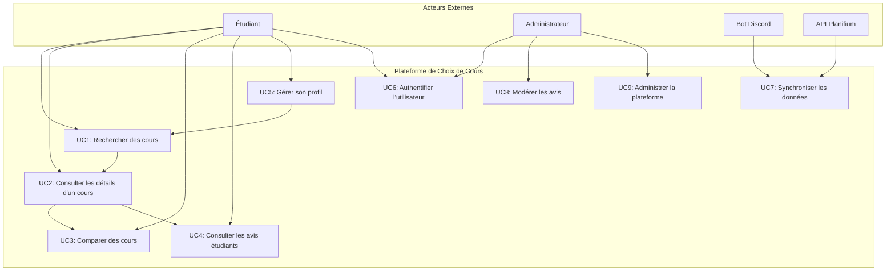

# Cas d'Utilisation

## Diagramme de Cas d'Utilisation

## Matrice de Traçabilité

| Besoin | Cas d'Utilisation | Priorité |
|--------|-------------------|----------|
| Centraliser les informations de cours | UC1, UC2, UC7 | Haute |
| Faciliter la comparaison | UC3 | Haute |
| Personnaliser l'expérience | UC5 | Moyenne |
| Fournir des retours d'expérience | UC4, UC8 | Haute |
| Sécuriser l'accès | UC6 | Haute |
| Maintenir la qualité des données | UC8, UC9 | Moyenne |

## UC1 - Rechercher des Cours

### Description
L'étudiant recherche des cours selon différents critères pour identifier les options qui correspondent à ses besoins.

### Acteurs
- **Primaire :** Étudiant
- **Secondaire :** API Planifium (fournit les données de cours)

### Préconditions
- L'étudiant est connecté à la plateforme

### Postconditions
- Une liste de cours correspondant aux critères est affichée
- Les résultats sont enregistrés pour l'historique de recherche

### Déclencheur
L'étudiant souhaite trouver des cours adaptés à son programme ou ses intérêts.

### Scénario Principal
1. L'étudiant accède à la page de recherche
2. L'étudiant saisit ses critères de recherche (code, titre, mots-clés, programme)
3. Le système valide les critères saisis
4. Le système interroge la base de données
5. Le système affiche les résultats sous forme de cartes
6. L'étudiant peut filtrer ou trier les résultats

### Scénarios Alternatifs

#### 3a. Critères invalides
- 3a.1. Le système affiche un message d'erreur
- 3a.2. L'étudiant corrige ses critères
- 3a.3. Retour à l'étape 3

#### 4a. Aucun résultat trouvé
- 4a.1. Le système affiche un message "Aucun cours trouvé"
- 4a.2. Le système suggère d'élargir les critères
- 4a.3. Retour à l'étape 2

### Dépendances
- UC6 (Authentification)
- UC7 (Synchronisation des données)

## UC2 - Consulter les Détails d'un Cours

### Description
L'étudiant consulte les informations détaillées d'un cours spécifique pour évaluer sa pertinence.

### Acteurs
- **Primaire :** Étudiant
- **Secondaire :** API Planifium (données de cours), Bot Discord (avis étudiants)

### Préconditions
- L'étudiant a identifié un cours d'intérêt (via UC1 ou navigation directe)
- Le cours existe dans la base de données

### Postconditions
- Les détails complets du cours sont affichés
- L'étudiant peut ajouter le cours à sa comparaison

### Déclencheur
L'étudiant clique sur un cours dans les résultats de recherche ou navigation.

### Scénario Principal
1. L'étudiant sélectionne un cours
2. Le système charge les détails du cours
3. Le système affiche les informations de base (code, titre, crédits, description)
4. Le système affiche les prérequis et co-requis
5. Le système affiche les statistiques académiques
6. Le système affiche les avis étudiants agrégés
7. L'étudiant peut ajouter le cours à sa comparaison

### Scénarios Alternatifs

#### 2a. Cours introuvable
- 2a.1. Le système affiche une erreur 404
- 2a.2. L'étudiant est redirigé vers la recherche

#### 6a. Aucun avis disponible
- 6a.1. Le système affiche "Aucun avis disponible"
- 6a.2. Le système propose de consulter les statistiques officielles

### Dépendances
- UC1 (Recherche)
- UC4 (Avis étudiants)

## UC3 - Comparer des Cours

### Description
L'étudiant compare plusieurs cours (maximum 3) pour faciliter sa prise de décision.

### Acteurs
- **Primaire :** Étudiant
- **Secondaire :** Aucun

### Préconditions
- L'étudiant a consulté au moins un cours
- L'étudiant n'a pas déjà 3 cours en comparaison

### Postconditions
- Un tableau comparatif est généré et affiché
- Les cours comparés sont sauvegardés temporairement

### Déclencheur
L'étudiant souhaite évaluer plusieurs options de cours simultanément.

### Scénario Principal
1. L'étudiant ajoute un premier cours à la comparaison
2. L'étudiant ajoute un deuxième cours à la comparaison
3. L'étudiant ajoute un troisième cours à la comparaison
4. L'étudiant accède au tableau comparatif
5. Le système génère un tableau avec les critères pertinents
6. L'étudiant consulte la comparaison
7. L'étudiant peut exporter ou sauvegarder la comparaison

### Scénarios Alternatifs

#### 1a. Limite de comparaison atteinte
- 1a.1. Le système affiche un message d'erreur
- 1a.2. L'étudiant doit retirer un cours avant d'en ajouter un autre

#### 4a. Moins de 2 cours en comparaison
- 4a.1. Le système affiche "Ajoutez au moins 2 cours pour comparer"
- 4a.2. Retour à l'étape 1

### Dépendances
- UC2 (Consultation des détails)

## UC4 - Consulter les Avis Étudiants

### Description
L'étudiant consulte les avis et évaluations d'autres étudiants sur un cours.

### Acteurs
- **Primaire :** Étudiant
- **Secondaire :** Bot Discord (collecte et fournit les avis)

### Préconditions
- Le cours a au moins 5 avis étudiants
- Les avis respectent le seuil de qualité minimal

### Postconditions
- Les avis agrégés sont affichés
- Les statistiques de satisfaction sont mises à jour

### Déclencheur
L'étudiant consulte les détails d'un cours et souhaite connaître l'expérience d'autres étudiants.

### Scénario Principal
1. L'étudiant accède aux avis depuis la page de détails du cours
2. Le système vérifie le nombre d'avis disponibles
3. Le système calcule les statistiques agrégées
4. Le système affiche la note moyenne
5. Le système affiche la distribution des notes
6. Le système affiche les avis individuels (anonymisés)
7. L'étudiant peut filtrer les avis par période ou note

### Scénarios Alternatifs

#### 2a. Insuffisamment d'avis
- 2a.1. Le système affiche "Avis insuffisants pour affichage"
- 2a.2. Le système propose de consulter les statistiques officielles

#### 5a. Aucun avis récent
- 5a.1. Le système affiche un avertissement sur la date des avis
- 5a.2. Les avis plus anciens restent accessibles

### Dépendances
- UC2 (Consultation des détails)
- UC7 (Collecte des avis)

## UC5 - Gérer son Profil

### Description
L'étudiant configure ses préférences et centres d'intérêt pour personnaliser son expérience.

### Acteurs
- **Primaire :** Étudiant
- **Secondaire :** Aucun

### Préconditions
- L'étudiant est authentifié
- Le profil utilisateur existe

### Postconditions
- Les préférences sont sauvegardées
- Les recommandations sont mises à jour

### Déclencheur
L'étudiant souhaite personnaliser son expérience de recherche et de consultation.

### Scénario Principal
1. L'étudiant accède à la section profil
2. L'étudiant consulte ses préférences actuelles
3. L'étudiant modifie ses préférences (théorie/pratique)
4. L'étudiant sélectionne ses centres d'intérêt
5. L'étudiant configure ses notifications
6. L'étudiant sauvegarde ses modifications
7. Le système confirme la sauvegarde

### Scénarios Alternatifs

#### 6a. Erreur de sauvegarde
- 6a.1. Le système affiche un message d'erreur
- 6a.2. L'étudiant peut réessayer la sauvegarde

### Dépendances
- UC6 (Authentification)

## UC6 - Authentifier l'Utilisateur

### Description
Le système authentifie l'utilisateur pour accéder aux fonctionnalités personnalisées.

### Acteurs
- **Primaire :** Étudiant, Administrateur
- **Secondaire :** Système d'authentification UdeM

### Préconditions
- L'utilisateur possède des identifiants UdeM valides
- Le système d'authentification est opérationnel

### Postconditions
- L'utilisateur est authentifié et sa session est active
- Les permissions appropriées sont accordées

### Déclencheur
L'utilisateur tente d'accéder à une fonctionnalité nécessitant une authentification.

### Scénario Principal
1. L'utilisateur accède à une fonctionnalité protégée
2. Le système redirige vers la page de connexion
3. L'utilisateur saisit ses identifiants UdeM
4. Le système valide les identifiants
5. Le système crée une session utilisateur
6. L'utilisateur est redirigé vers la fonctionnalité demandée

### Scénarios Alternatifs

#### 4a. Identifiants invalides
- 4a.1. Le système affiche un message d'erreur
- 4a.2. L'utilisateur peut réessayer ou réinitialiser son mot de passe

#### 4b. Compte désactivé
- 4b.1. Le système affiche un message explicatif
- 4b.2. L'utilisateur est redirigé vers le support

### Dépendances
- Système d'authentification UdeM

## UC7 - Synchroniser les Données

### Description
Le système synchronise automatiquement les données avec les sources externes (API Planifium, Discord).

### Acteurs
- **Primaire :** Système (automatique)
- **Secondaire :** API Planifium, Bot Discord

### Préconditions
- Les sources de données externes sont accessibles
- Le système de synchronisation est configuré

### Postconditions
- Les données sont mises à jour dans la base locale
- Les logs de synchronisation sont enregistrés

### Déclencheur
Synchronisation programmée ou déclenchée manuellement.

### Scénario Principal
1. Le système déclenche la synchronisation
2. Le système se connecte à l'API Planifium
3. Le système récupère les nouvelles données de cours
4. Le système compare avec les données locales
5. Le système met à jour les données modifiées
6. Le système collecte les nouveaux avis Discord
7. Le système valide et stocke les nouveaux avis
8. Le système enregistre les logs de synchronisation

### Scénarios Alternatifs

#### 2a. API Planifium indisponible
- 2a.1. Le système enregistre l'erreur
- 2a.2. Le système programme une nouvelle tentative
- 2a.3. Le système continue avec les autres sources

#### 6a. Avis Discord invalides
- 6a.1. Le système rejette les avis non conformes
- 6a.2. Le système notifie les modérateurs

### Dépendances
- API Planifium
- Bot Discord

## UC8 - Modérer les Avis

### Description
L'administrateur modère les avis étudiants pour maintenir la qualité et la pertinence.

### Acteurs
- **Primaire :** Administrateur
- **Secondaire :** Système de modération automatique

### Préconditions
- L'administrateur est authentifié avec les permissions appropriées
- Des avis en attente de modération existent

### Postconditions
- Les avis sont approuvés ou rejetés
- Les statistiques de modération sont mises à jour

### Déclencheur
De nouveaux avis nécessitent une modération manuelle ou automatique.

### Scénario Principal
1. Le système détecte de nouveaux avis
2. Le système applique les filtres automatiques
3. Les avis suspects sont marqués pour modération manuelle
4. L'administrateur consulte la liste des avis en attente
5. L'administrateur évalue chaque avis
6. L'administrateur approuve ou rejette l'avis
7. Le système met à jour le statut de l'avis
8. L'avis approuvé devient visible pour les étudiants

### Scénarios Alternatifs

#### 2a. Avis automatiquement approuvé
- 2a.1. L'avis est directement publié
- 2a.2. Le système enregistre l'approbation automatique

#### 6a. Avis rejeté
- 6a.1. L'avis est supprimé de la base de données
- 6a.2. Le système peut notifier l'auteur (si identifiable)

### Dépendances
- UC6 (Authentification)
- UC7 (Collecte des avis)

## UC9 - Administrer la Plateforme

### Description
L'administrateur gère la plateforme, les utilisateurs et les données système.

### Acteurs
- **Primaire :** Administrateur
- **Secondaire :** Aucun

### Préconditions
- L'administrateur est authentifié avec les permissions d'administration
- L'interface d'administration est accessible

### Postconditions
- Les modifications administratives sont appliquées
- Les logs d'administration sont enregistrés

### Déclencheur
L'administrateur souhaite effectuer des tâches de maintenance ou de configuration.

### Scénario Principal
1. L'administrateur accède à l'interface d'administration
2. L'administrateur consulte les métriques de la plateforme
3. L'administrateur peut gérer les utilisateurs
4. L'administrateur peut configurer les paramètres système
5. L'administrateur peut déclencher des synchronisations manuelles
6. L'administrateur peut consulter les logs système
7. L'administrateur sauvegarde ses modifications

### Scénarios Alternatifs

#### 2a. Problème système détecté
- 2a.1. Le système affiche des alertes
- 2a.2. L'administrateur peut prendre des actions correctives

### Dépendances
- UC6 (Authentification)
- UC8 (Modération)

## Critères d'Acceptation

### UC1 - Recherche de Cours
- [ ] La recherche retourne des résultats pertinents en moins de 2 secondes
- [ ] Les filtres fonctionnent correctement
- [ ] La recherche gère les caractères spéciaux et accents
- [ ] Les résultats sont triables par différents critères

### UC2 - Consultation des Détails
- [ ] Toutes les informations du cours sont affichées correctement
- [ ] Les liens vers les prérequis fonctionnent
- [ ] Les statistiques sont calculées et affichées
- [ ] L'ajout à la comparaison fonctionne

### UC3 - Comparaison de Cours
- [ ] Maximum 3 cours peuvent être comparés simultanément
- [ ] Le tableau comparatif est lisible et complet
- [ ] L'export de la comparaison fonctionne
- [ ] La gestion des cours en comparaison est intuitive

### UC4 - Avis Étudiants
- [ ] Seuil minimal de 5 avis respecté avant affichage
- [ ] Les statistiques agrégées sont correctes
- [ ] L'anonymisation des avis est respectée
- [ ] Les filtres d'avis fonctionnent

### UC5 - Gestion du Profil
- [ ] Les préférences sont sauvegardées correctement
- [ ] Les recommandations sont mises à jour selon le profil
- [ ] L'interface est intuitive et responsive
- [ ] La validation des données fonctionne

### UC6 - Authentification
- [ ] L'intégration avec UdeM fonctionne
- [ ] Les sessions sont sécurisées
- [ ] La gestion des erreurs d'authentification est appropriée
- [ ] Le timeout de session est configuré correctement

### UC7 - Synchronisation
- [ ] La synchronisation avec Planifium fonctionne
- [ ] La collecte d'avis Discord est opérationnelle
- [ ] Les erreurs de synchronisation sont gérées
- [ ] Les logs de synchronisation sont détaillés

### UC8 - Modération
- [ ] L'interface de modération est fonctionnelle
- [ ] Les filtres automatiques fonctionnent
- [ ] La validation manuelle est efficace
- [ ] Les statistiques de modération sont disponibles

### UC9 - Administration
- [ ] L'interface d'administration est sécurisée
- [ ] Les métriques système sont disponibles
- [ ] La gestion des utilisateurs fonctionne
- [ ] Les logs d'administration sont complets
