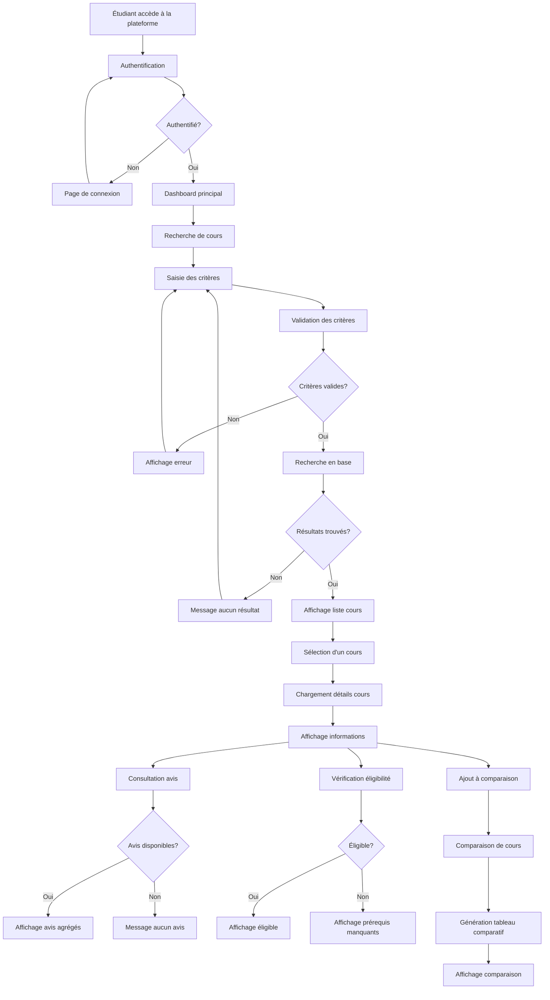
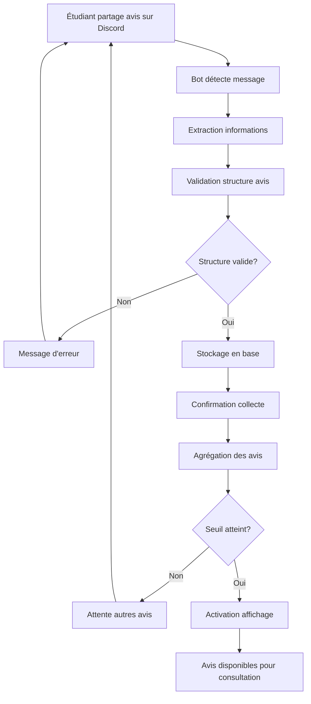
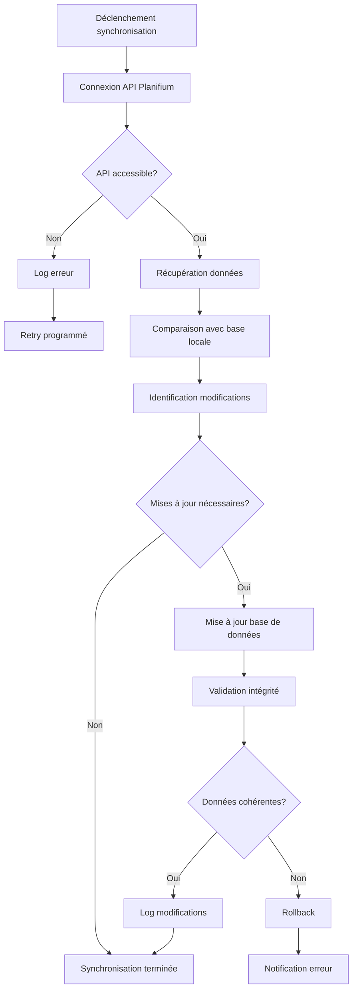
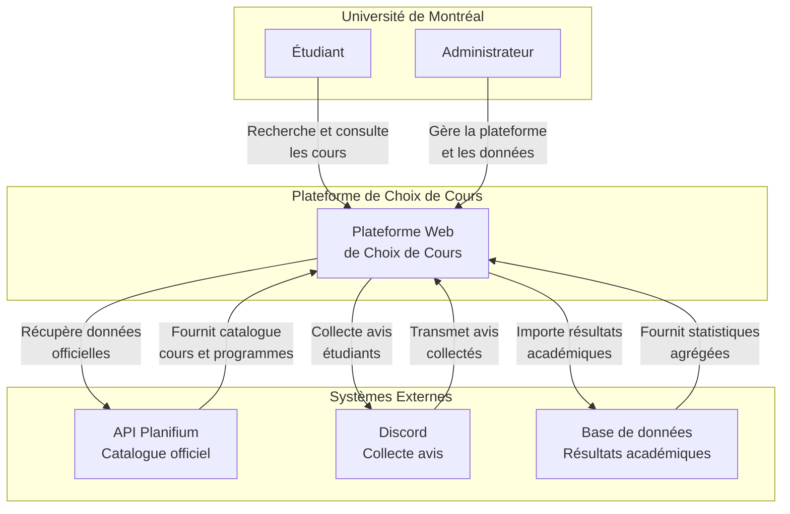
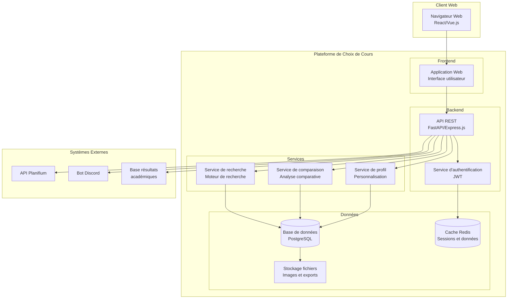

# Conception

## Diagrammes d'Activités

### Flux Principal - Recherche et Consultation de Cours

### Flux de Collecte d'Avis

### Flux de Synchronisation des Données

## Modèle C4

### Niveau 1 - Diagramme de Contexte

### Niveau 2 - Diagramme de Conteneurs

### Détail des Conteneurs

#### Application Web (Frontend)
- **Technologie** : React.js ou Vue.js
- **Responsabilité** : Interface utilisateur, interaction client
- **Communication** : HTTP/HTTPS avec l'API REST

#### API REST (Backend)
- **Technologie** : FastAPI (Python) ou Express.js (Node.js)
- **Responsabilité** : Logique métier, orchestration des services
- **Communication** : HTTP/HTTPS avec le frontend, base de données

#### Service d'Authentification
- **Technologie** : JWT, OAuth 2.0
- **Responsabilité** : Gestion des sessions, sécurité
- **Communication** : Cache Redis pour les sessions

#### Service de Recherche
- **Technologie** : Elasticsearch ou recherche SQL
- **Responsabilité** : Indexation et recherche de cours
- **Communication** : Base de données PostgreSQL

#### Service de Comparaison
- **Technologie** : Logique métier personnalisée
- **Responsabilité** : Génération de tableaux comparatifs
- **Communication** : Base de données pour récupérer les données

#### Service de Profil
- **Technologie** : Logique métier personnalisée
- **Responsabilité** : Gestion des préférences utilisateur
- **Communication** : Base de données pour persister les profils

#### Base de Données
- **Technologie** : PostgreSQL
- **Responsabilité** : Persistance des données principales
- **Contenu** : Cours, utilisateurs, avis, profils

#### Cache Redis
- **Technologie** : Redis
- **Responsabilité** : Cache des sessions et données fréquentes
- **Contenu** : Sessions utilisateurs, résultats de recherche

## Architecture Technique

### Stack Technologique

#### Frontend
- **Framework** : React.js avec TypeScript
- **UI Library** : Material-UI ou Ant Design
- **State Management** : Redux Toolkit
- **Build Tool** : Vite ou Create React App

#### Backend
- **Framework** : FastAPI (Python) ou Express.js (Node.js)
- **ORM** : SQLAlchemy (Python) ou Prisma (Node.js)
- **Validation** : Pydantic (Python) ou Joi (Node.js)
- **Documentation** : OpenAPI/Swagger

#### Base de Données
- **Principal** : PostgreSQL
- **Cache** : Redis
- **Recherche** : Elasticsearch (optionnel)

#### Infrastructure
- **Conteneurisation** : Docker
- **Orchestration** : Docker Compose
- **Monitoring** : Prometheus + Grafana
- **Logs** : ELK Stack

### Patterns Architecturaux

#### API REST
- **Style** : RESTful avec OpenAPI
- **Authentification** : JWT Bearer tokens
- **Versioning** : URL versioning (/api/v1/)
- **Rate Limiting** : 1000 req/hour par utilisateur

#### Microservices (Optionnel)
- **Service de recherche** : Recherche et indexation
- **Service d'avis** : Gestion des avis étudiants
- **Service de comparaison** : Logique comparative
- **Service de profil** : Gestion des utilisateurs

#### CQRS (Command Query Responsibility Segregation)
- **Commands** : Modifications des données (avis, profils)
- **Queries** : Lectures des données (recherche, consultation)
- **Event Sourcing** : Historique des modifications

### Sécurité

#### Authentification et Autorisation
- **JWT Tokens** : Authentification stateless
- **OAuth 2.0** : Intégration avec systèmes UdeM
- **RBAC** : Rôles basés sur les permissions
- **Rate Limiting** : Protection contre les abus

#### Protection des Données
- **Chiffrement** : HTTPS, chiffrement au repos
- **Validation** : Input validation et sanitization
- **CORS** : Configuration restrictive
- **Headers de sécurité** : CSP, HSTS, etc.

#### Conformité
- **Loi 25** : Protection des données personnelles
- **RGPD** : Conformité européenne
- **Audit Trail** : Traçabilité des accès
- **Consentement** : Gestion explicite du consentement

## Décisions Architecturales

### Décision 1 : API REST vs GraphQL
**Choix** : API REST
**Justification** : Simplicité, écosystème mature, documentation OpenAPI
**Alternatives considérées** : GraphQL pour la flexibilité des requêtes

### Décision 2 : Base de données relationnelle vs NoSQL
**Choix** : PostgreSQL (relationnel)
**Justification** : Cohérence des données, ACID, requêtes complexes
**Alternatives considérées** : MongoDB pour la flexibilité du schéma

### Décision 3 : Monolithe vs Microservices
**Choix** : Monolithe modulaire
**Justification** : Simplicité de déploiement, équipe réduite
**Alternatives considérées** : Microservices pour la scalabilité

### Décision 4 : Cache en mémoire vs base de données
**Choix** : Redis pour le cache
**Justification** : Performance, persistance optionnelle
**Alternatives considérées** : Cache applicatif, base de données

### Décision 5 : Authentification JWT vs sessions
**Choix** : JWT tokens
**Justification** : Stateless, scalabilité, intégration mobile
**Alternatives considérées** : Sessions serveur pour la sécurité
