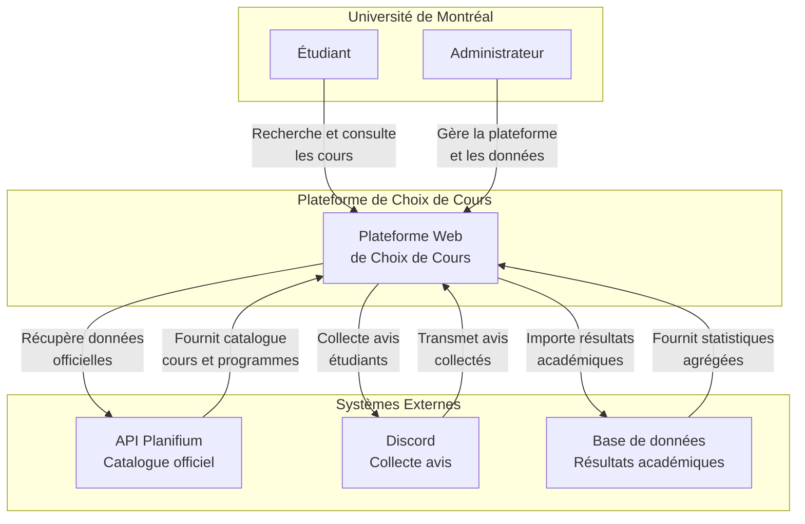
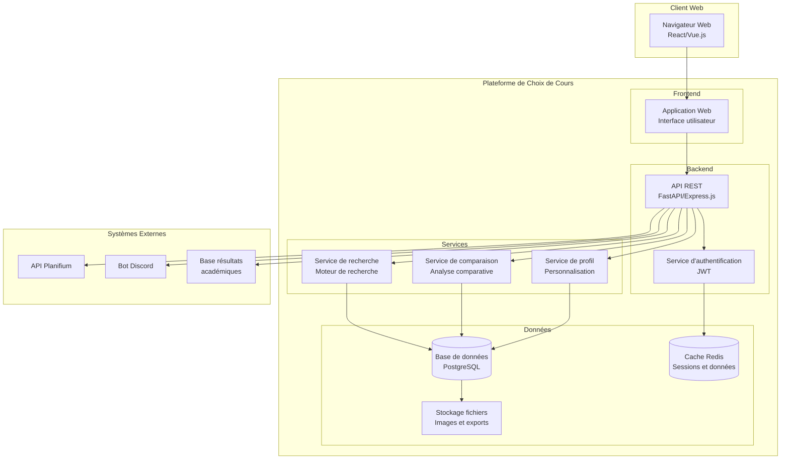

# Architecture du Système

## Modèle C4

### Niveau 1 - Diagramme de Contexte

### Niveau 2 - Diagramme de Conteneurs

## Détail des Conteneurs

### Application Web (Frontend)
- **Technologie** : React.js ou Vue.js
- **Responsabilité** : Interface utilisateur, interaction client
- **Communication** : HTTP/HTTPS avec l'API REST

### API REST (Backend)
- **Technologie** : FastAPI (Python) ou Express.js (Node.js)
- **Responsabilité** : Logique métier, orchestration des services
- **Communication** : HTTP/HTTPS avec le frontend, base de données

### Service d'Authentification
- **Technologie** : JWT, OAuth 2.0
- **Responsabilité** : Gestion des sessions, sécurité
- **Communication** : Cache Redis pour les sessions

### Service de Recherche
- **Technologie** : Elasticsearch ou recherche SQL
- **Responsabilité** : Indexation et recherche de cours
- **Communication** : Base de données PostgreSQL

### Service de Comparaison
- **Technologie** : Logique métier personnalisée
- **Responsabilité** : Génération de tableaux comparatifs
- **Communication** : Base de données pour récupérer les données

### Service de Profil
- **Technologie** : Logique métier personnalisée
- **Responsabilité** : Gestion des préférences utilisateur
- **Communication** : Base de données pour persister les profils

### Base de Données
- **Technologie** : PostgreSQL
- **Responsabilité** : Persistance des données principales
- **Contenu** : Cours, utilisateurs, avis, profils

### Cache Redis
- **Technologie** : Redis
- **Responsabilité** : Cache des sessions et données fréquentes
- **Contenu** : Sessions utilisateurs, résultats de recherche

## Patterns Architecturaux

### API REST
- **Style** : RESTful avec OpenAPI
- **Authentification** : JWT Bearer tokens
- **Versioning** : URL versioning (/api/v1/)
- **Rate Limiting** : 1000 req/hour par utilisateur

### Microservices (Optionnel)
- **Service de recherche** : Recherche et indexation
- **Service d'avis** : Gestion des avis étudiants
- **Service de comparaison** : Logique comparative
- **Service de profil** : Gestion des utilisateurs

### CQRS (Command Query Responsibility Segregation)
- **Commands** : Modifications des données (avis, profils)
- **Queries** : Lectures des données (recherche, consultation)
- **Event Sourcing** : Historique des modifications

## Sécurité

### Authentification et Autorisation
- **JWT Tokens** : Authentification stateless
- **OAuth 2.0** : Intégration avec systèmes UdeM
- **RBAC** : Rôles basés sur les permissions
- **Rate Limiting** : Protection contre les abus

### Protection des Données
- **Chiffrement** : HTTPS, chiffrement au repos
- **Validation** : Input validation et sanitization
- **CORS** : Configuration restrictive
- **Headers de sécurité** : CSP, HSTS, etc.

### Conformité
- **Loi 25** : Protection des données personnelles
- **RGPD** : Conformité européenne
- **Audit Trail** : Traçabilité des accès
- **Consentement** : Gestion explicite du consentement

