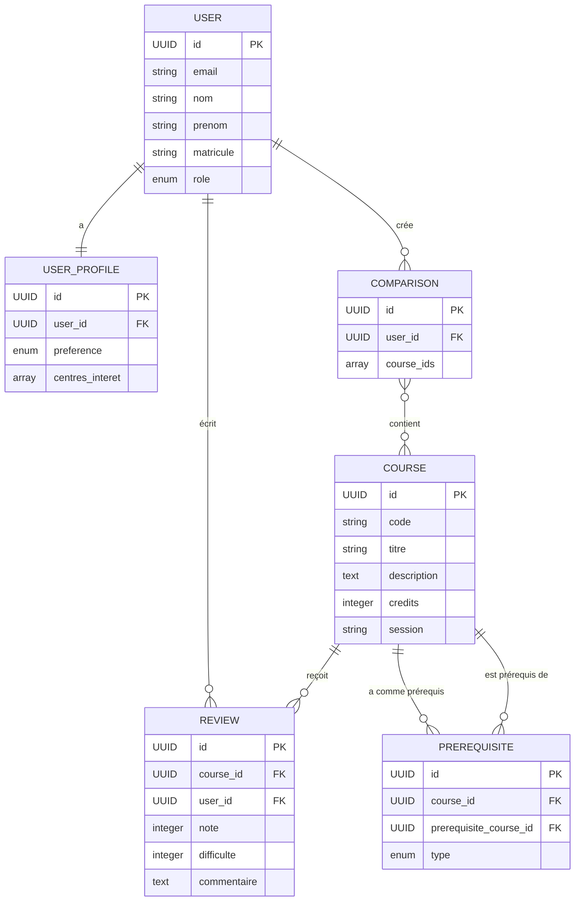

# Modèle de Données

## Schéma de Base de Données

### Entités Principales

#### User (Utilisateur)
```
User {
    id: UUID (PK)
    email: string (unique)
    nom: string
    prenom: string
    matricule: string (unique)
    role: enum (etudiant, admin, moderateur)
    date_creation: datetime
    derniere_connexion: datetime
}
```

#### Course (Cours)
```
Course {
    id: UUID (PK)
    code: string (unique, ex: "IFT2255")
    titre: string
    description: text
    credits: integer
    session: string
    programme: string
    niveau: integer
    moyenne_generale: float
    taux_echec: float
    nombre_inscrits: integer
    date_maj: datetime
}
```

#### Prerequisite (Prérequis)
```
Prerequisite {
    id: UUID (PK)
    course_id: UUID (FK -> Course)
    prerequisite_course_id: UUID (FK -> Course)
    type: enum (obligatoire, recommande, corequisite)
}
```

#### Review (Avis)
```
Review {
    id: UUID (PK)
    course_id: UUID (FK -> Course)
    user_id: UUID (FK -> User, nullable pour anonymat)
    note: integer (1-5)
    difficulte: integer (1-5)
    charge_travail: integer (1-5)
    commentaire: text
    session: string
    statut: enum (en_attente, approuve, rejete)
    date_creation: datetime
    date_moderation: datetime
}
```

#### UserProfile (Profil Utilisateur)
```
UserProfile {
    id: UUID (PK)
    user_id: UUID (FK -> User, unique)
    preference_theorie_pratique: enum (equilibre, theorique, pratique)
    centres_interet: array[string]
    notification_actives: boolean
    date_maj: datetime
}
```

#### Comparison (Comparaison)
```
Comparison {
    id: UUID (PK)
    user_id: UUID (FK -> User)
    course_ids: array[UUID]
    date_creation: datetime
    date_expiration: datetime
}
```

#### SyncLog (Log de Synchronisation)
```
SyncLog {
    id: UUID (PK)
    source: string (planifium, discord, resultats)
    statut: enum (succes, echec, partiel)
    nb_enregistrements: integer
    details: jsonb
    date_execution: datetime
    duree: integer (secondes)
}
```

## Relations



## Contraintes et Index

### Contraintes d'Intégrité
- `User.email` : UNIQUE, NOT NULL
- `User.matricule` : UNIQUE, NOT NULL
- `Course.code` : UNIQUE, NOT NULL
- `Review.note` : CHECK (note BETWEEN 1 AND 5)
- `Review.difficulte` : CHECK (difficulte BETWEEN 1 AND 5)
- `Review.charge_travail` : CHECK (charge_travail BETWEEN 1 AND 5)

### Index pour Performance
- `Course.code` : B-tree index
- `Course.programme` : B-tree index
- `Review.course_id` : B-tree index
- `Review.statut` : B-tree index
- `User.email` : B-tree index (unique)
- `Course.titre` : GIN index (full-text search)
- `Review.commentaire` : GIN index (full-text search)

## Stratégie de Cache (Redis)

### Données Cachées
```
cache:sessions:{user_id} -> SessionData (TTL: 24h)
cache:course:{course_id} -> CourseData (TTL: 1h)
cache:search:{query_hash} -> SearchResults (TTL: 15min)
cache:reviews:{course_id} -> AggregatedReviews (TTL: 30min)
```

### Invalidation du Cache
- **Course modifié** : Invalider `cache:course:{id}` et `cache:search:*`
- **Review ajouté** : Invalider `cache:reviews:{course_id}`
- **Session expirée** : Supprimer `cache:sessions:{user_id}`

## Migration des Données

### Ordre de Création
1. Tables indépendantes : `User`, `Course`
2. Tables de relation : `UserProfile`, `Prerequisite`
3. Tables dépendantes : `Review`, `Comparison`, `SyncLog`

### Scripts de Migration
- `V1__create_users.sql`
- `V2__create_courses.sql`
- `V3__create_reviews.sql`
- `V4__create_profiles.sql`
- `V5__create_indexes.sql`

