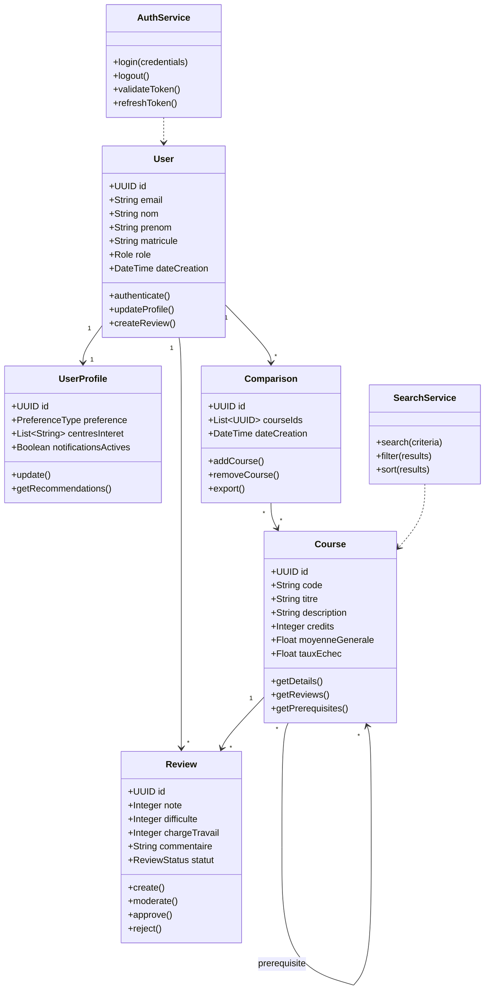

# Diagrammes UML

## Diagramme de Classes

## Diagramme de Séquence - Recherche de Cours

## Diagramme de Séquence - Consultation d'un Cours

## Diagramme d'État - Modération d'Avis

## Diagramme de Composants

## Diagramme de Déploiement

